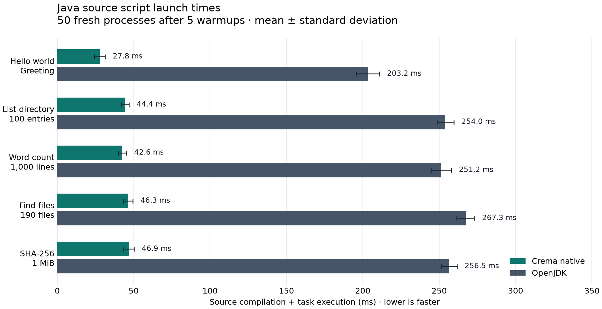

# Crema source launcher

A GraalVM native executable with `javac` precompiled. Crema loads and runs the
bytecode compiled from your Java source at launch time.

Preserves all of `java.base` (`-H:Preserve=module=java.base`). Other JDK classes
can be loaded dynamically. Classes already included in the image may require
preservation if runtime-loaded code accesses members removed during the build.

## Build

Requires a C toolchain (Xcode Command Line Tools on macOS).

```sh
sdk use java 25.4.4+1-graal
./build.sh
./run.sh examples/HelloWorld.java
```

Prints `Hello, world!`. The executable is **216.2 MiB**; keep `build/`, including
its companion libraries, and the selected JDK available at runtime.

## Examples

```sh
./run.sh examples/ListDirectory.java .
./run.sh examples/WordCount.java README.md
./run.sh examples/FindFiles.java '*.java' examples
./run.sh examples/Sha256.java README.md
```

`WordCount` and `Sha256` also read stdin when no file is given.

## Benchmark

Requires Python 3 and [hyperfine](https://github.com/sharkdp/hyperfine). Runs all
five examples against OpenJDK and regenerates the chart and raw measurements.

```sh
python3 -m venv build/benchmark-venv
build/benchmark-venv/bin/python -m pip install -r requirements.txt
build/benchmark-venv/bin/python benchmark.py --jdk-home "$HOME/.sdkman/candidates/java/25.0.1-open"
```

Crema measured **5.47–7.30× faster** on macOS ARM64: 50 fresh processes per script
and launcher after 5 warmups. Times include source compilation and task execution
with warm filesystem caches.



[Raw timings](benchmarks/latest/timings.json) · [Environment](benchmarks/latest/environment.json)
